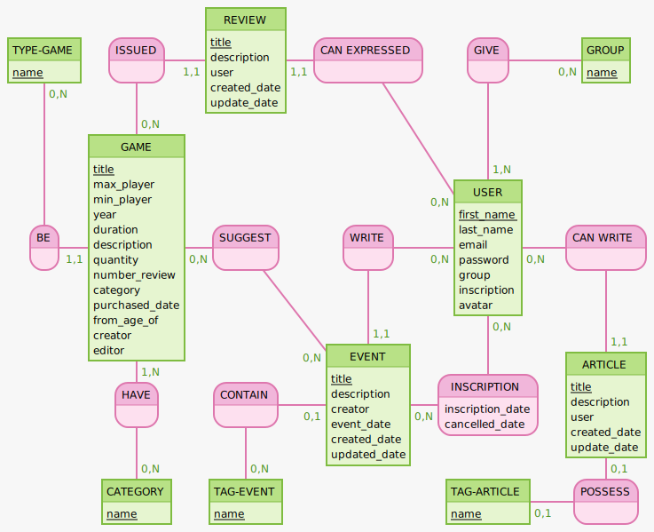
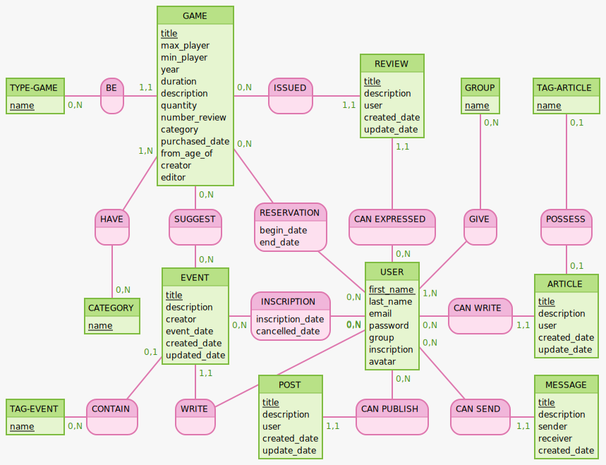

# MCD Jeux de société

                                    * MCD pour la V1 *
-------------------------------------------------------------------------------------------------------------------------

                                    * MCD pour la V2 *
-------------------------------------------------------------------------------------------------------------------------

## MLD et MVC pour la V2

#### (La table message et post ne sont présent dans la V1)

TAG-EVENT: name
CONTAIN, 0N TAG-EVENT,01 EVENT
EVENT: title, description, creator, event_date, created_date, updated_date
USER: first_name, last_name, email, password,  group, inscription, avatar
INSCRIPTION, 0N EVENT, 0N USER : inscription_date, cancelled_date
WRITE, 0N USER, 11 EVENT
SUGGEST, 0N GAME, 0N EVENT

GAME: title, max_player, min_player, year, duration, description, quantity, number_review, category, purchased_date, from_age_of, creator, editor
RESERVATION, 0N GAME, 0N USER: begin_date, end_date
TYPE-GAME: name
BE, 0N TYPE-GAME, 11 GAME
GIVE, 0N GROUP, 1N USER
GROUP: name
ISSUED, 11 REVIEW,0N GAME

REVIEW:  title, description, user, created_date, update_date
CAN  EXPRESSED, 11 REVIEW, 0N USER
HAVE,0N CATEGORY, 1N GAME
CATEGORY: name
CAN  SEND,11 MESSAGE, 0N USER
MESSAGE: title, description,  sender, receiver, created_date

CAN  WRITE, 11 ARTICLE, 0N USER

ARTICLE: title, description , user, created_date, update_date

POSSESS, 01 TAG-ARTICLE,01 ARTICLE
TAG-ARTICLE: name
CAN  PUBLISH, 11 POST, 0N USER
POST: title, description, user, created_date, update_date
::

-----------------------------------------------------------------------------------------------------------------------------

group(id, name)
tag_article(id, name)
category(id,name)
type_game(id, name)
tag_event (id, name)
game(id,title, max_player, min_player, year, duration, description, quantity, number_review, category, purchased_date, from_age_of, creator, editor)
article(id, title, description, created_date, update_date , #user(id))
review(id,  title, description, created_date , update_date, #user(id), #game(id))
event(id ,title, description, event_date,  created_date ,updated_date, #user(id), #game(id))
user(id, first_name, last_name, email, password, #groupe, #message,#game, #event,#review,#post,#article)
event_has_user(id, inscription_date, cancelled_date,#event(id), #user(id))
event_has_game(id, #event(id), #game(id))
group_has_user(id,#group(id),#user(id))
category_has_game(id, #category(id),#game(id))

 b2. MLD V2
post(id, title, description, created_date , update_date, #user(id)) Autre version
message(id, title, description,   created_date , #user(id)) Autre version
game_has_user(id,begin_date, end_date,#game(id),#user(id))
