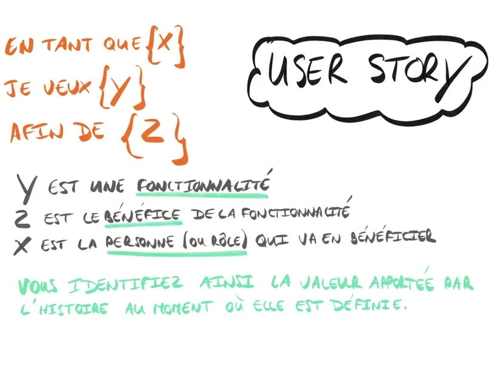
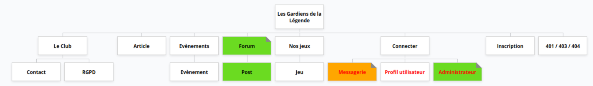

# Users Stories 

### Les users stories du projet Jeux de société !

### Quelques liens utiles :

[Le site des gardiens de la légendes](https://lesgardiensdelalegende.fr)

[Récap syntaxe Markdown](https://www.christopheducamp.com/2014/09/18/love-markdown/#images)

[Gloomap => Les Gardiens de la légende](https://www.gloomaps.com/DfzHmmhDab)

# Users stories V1

| En tant que | Je veux                                                                 | Afin de |
| ----------- | ----------------------------------------------------------------------- | ------- |
| Visiteur    | accéder la page home et visualiser des événements, des jeux de sociétés et des articles |         |
| Visiteur    | accéder à la page Événement et visualiser les évènements                |         |
| Visiteur    | accéder à la page forum et consulter les posts                          |         |
| Visiteur    | accéder à la page liste des jeux mis à disposition                      |         |
| Visiteur    | accéder à la page d’un jeu de société                                   |         |
| Visiteur    | accéder à la page contact du club                                       |         |
| Visiteur    | accéder à la page présentation du Club                                  |         |
| Visiteur    | accéder à la page RGPD                                                  |         |
| Visiteur    | peut s’inscrire pour devenir utilisateur                                |         |
| Visiteur    | bouton pour remonter en haut de la page                                 |         |
| Visiteur    | pouvoir accéder au réseau sociaux (discord et facebook)                 |         |
| ----------- | ----------------------------------------------------------------------- | ------- |
| Utilisateur | fait tout ce que fait un visiteur                                       |         |
| Utilisateur | pouvoir modifier mon profil                                             |         |
| Utilisateur | pouvoir supprimer mon profil                                            |         |
| Utilisateur | mettre un commentaire sur article                                       |         |
| Utilisateur | écrire un article                                                       |         |
| Utilisateur | proposer un évènement                                                   |         |
| Utilisateur | s’inscrire à un évènement                                               |         |

# Users Stories V2

| En tant que    | Je veux                                                                   | Afin de |
| -------------- | ------------------------------------------------------------------------- | ------- |
| Administrateur | mettre en article épinglé en haut de la page                              |
| Administrateur | données les droits aux utilisateurs                                       |
| Administrateur | bannir un utilisateur du site                                             |
| Administrateur | écrire un post                                                            |
| Administrateur | modifier son post                                                         |
| Administrateur | répondre à un post                                                        |
| -------        | -------                                                                   | ------- |
| Utilisateur    | mettre un avis sur un jeu de société                                      |
| Utilisateur    | demande de prêt de jeu de société                                         |
| Utilisateur    | signaler un message ou post à supprimer  / modérer                        |
| -------        | -------                                                                   | ------- |
| Modérateur     | modifier un message d’un utilisateur                                      |
| Modérateur     | supprimer les message d’un utilisateur                                    |
| Modérateur     | supprimer un post                                                         |
| Modérateur     | système de connexion unique via passport.js                               |
| Modérateur     | pouvoir me connecter avec un compte google, facebook                      |
| Modérateur     | faire des filtres pour rechercher un jeu dans la liste des jeux           |
| Modérateur     | système de code barre en scannant le jeu pour l’insérer en bdd            |
| Modérateur     | faire une pagination pour la liste des jeux ou évènement                  |
| -------        | -------                                                                   | ------- |
| Utilisateur    | proposer l’achat d’un jeu                                                 |
| Utilisateur    | pouvoir recevoir des rappel pour rendre le jeu emprunté à une date butoir |
| Utilisateur    | proposer de prendre la clé du local                                       |
| Utilisateur    | confirmer la prise de la clé du local                                     |
